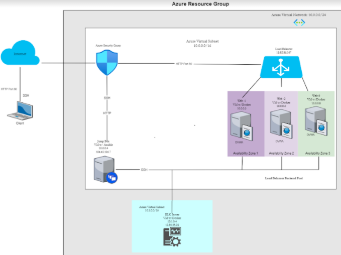
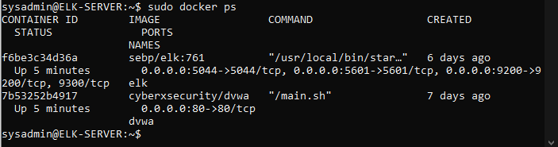

# Cloud-Project
Azure Environment
## Automated ELK Stack Deployment

The files in this repository were used to configure the network depicted below.

These files have been tested and used to generate a live ELK deployment on Azure. They can be used to either recreate the entire deployment pictured above. Alternatively, selected portions of the yaml file may be used to install only certain pieces of it, such as Filebeat.
  - elk.yml

This document contains the following details:
- Description of the Topology
- Access Policies
- ELK Configuration
  - Beats in Use
  - Machines Being Monitored
- How to Use the Ansible Build

### Description of the Topology

The main purpose of this network is to expose a load-balanced and monitored instance of DVWA, the D*mn Vulnerable Web Application.

Load balancing ensures that the application will be highly available, in addition to restricting inbound access to the network. The off-loading function of a load balancer defends an organization against distributed denial-of-service (DDoS) attacks. It does this by shifting attack traffic from the corporate server to a public cloud provider.

A jumpbox creates a separation between networks with different security requirements. Acts as a single audit point for traffic and a single place where user accounts can be managed. Provides auditing control. 

Integrating an ELK server allows users to easily monitor the vulnerable VMs for changes to the "file systems of the VMs on network" and "system metrics".
- Filebeats watch for log info about file systems and files that have changed and when.
- Metricbeat records and detects changes in system metrics, such as CPU usage, failed SSH login attempts, failed sudo escalations and CPU/RAM statistics.

The configuration details of each machine may be found below.
_Note: Use the [Markdown Table Generator](http://www.tablesgenerator.com/markdown_tables) to add/remove values from the table_.

| Name       | Function   | IP Address | Operating System |
|------------|------------|------------|------------------|
| Jump Box   | Gateway    | 10.0.0.4   |Linux/Ubuntu 18.04|
| Web-1      | Web Server | 10.0.0.5   |Linux/Ubuntu 18.04|
| Web-2      | Web Server | 10.0.0.6   |Linux/Ubuntu 18.04|
| Web-3      | Web Server | 10.0.0.8   |Linux/Ubuntu 18.04|
| Elk-Server | Monitoring | 10.1.0.4   |Linux/Ubuntu 18.04|

### Access Policies

The machines on the internal network are not exposed to the public Internet. 

Only the _Jumpbox_ machine can accept connections from the Internet. Access to this machine is only allowed from the following IP addresses:
- 10.0.0.5
- 10.0.0.6
- 10.0.0.8

Machines within the network can only be accessed by SSH.
- Elk VM - 10.1.0.4
- JumpBox VM - 10.0.0.4

A summary of the access policies in place can be found in the table below.

| Name     | Publicly Accessible | Allowed IP Addresses |
|----------|---------------------|----------------------|
| Jump Box | Yes/No              | 104.45.196.7         |
| ELK      | No                  | 10.1.0.4             |
| Web-1    | No                  | 10.0.0.5             |
| Web-2    | No                  | 10.0.0.6             |
| Web-3    | No                  | 10.0.0.8             |
|

### Elk Configuration

The ELK VM exposes an Elastic Stack instance. **Docker** is used to download and manage an ELK container
Ansible was used to automate configuration of the ELK machine. No configuration was performed manually, which is advantageous because multiple VMs can be updated, configured automatically. 

- _TODO: What is the main advantage of automating configuration with Ansible?_

The playbook implements the following tasks:
- Configure ELK VM with Docker
- Gathering Facts
- Install docker.io
- Install pip3
- Install Docker python module
- Increase Memory
- Download and Launch a docker elk container

The following screenshot displays the result of running `docker ps` after successfully configuring the ELK instance.

### Target Machines & Beats
This ELK server is configured to monitor the following machines:
- 10.0.0.5
- 10.0.0.6	
- 10.0.0.8

We have installed the following Beats on these machines:
-filebeats
-metricbeats

These Beats allow us to collect the following information from each machine:
- Filebeat: Detects changes to the filesystem. Collect Apache Logs
- Metricbeat: Detects changes in system metrics 
    -CPU Usage
    -Detect SSH login attempts
    -Failed sudo escalations
    -CPU/RAM statistics

### Using the Playbook
In order to use the playbook, you will need to have an Ansible control node already configured. Assuming you have such a control node provisioned: 

SSH into the control node and follow the steps below:
- Copy the playbooks to the Ansible Control Node
- Update the correct IP addreses and Ports
- Run the playbook, and navigate to web servers check that the installation worked as expected.

_TODO: Answer the following questions to fill in the blanks:_
- _Which file is the playbook? Where do you copy it?_
- _Which file do you update to make Ansible run the playbook on a specific machine? How do I specify which machine to install the ELK server on versus which to install Filebeat on?_
- _Which URL do you navigate to in order to check that the ELK server is running?

_As a **Bonus**, provide the specific commands the user will need to run to download the playbook, update the files, etc._
